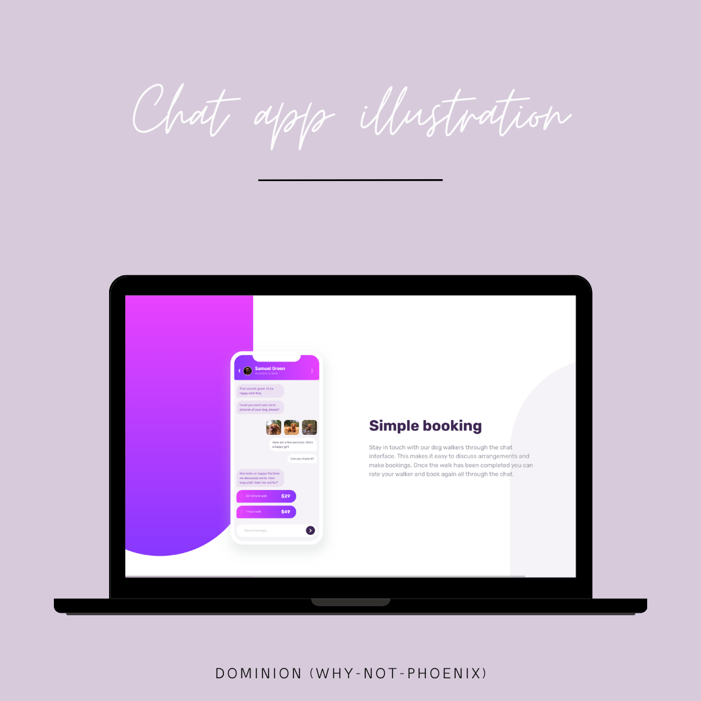
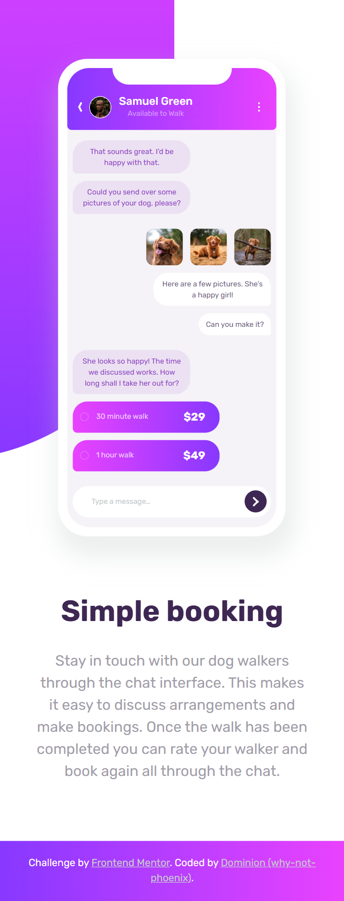
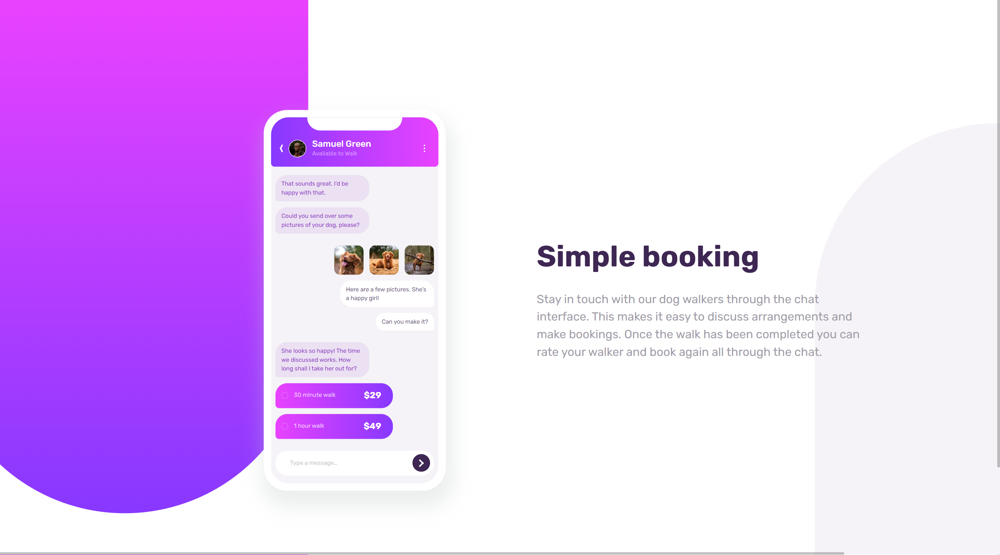

# Frontend Mentor - Chat app CSS illustration solution

This is a solution to the [Chat app CSS illustration challenge on Frontend Mentor](https://www.frontendmentor.io/challenges/chat-app-css-illustration-O5auMkFqY). Frontend Mentor challenges help you improve your coding skills by building realistic projects.

## Table of contents

- [Overview](#overview)
  - [The challenge](#the-challenge)
  - [Screenshot](#screenshot)
  - [Links](#links)
- [My process](#my-process)
  - [Built with](#built-with)
  - [What I learned](#what-i-learned)
  - [Continued development](#continued-development)
  - [Useful resources](#useful-resources)
- [Author](#author)
- [Acknowledgments](#acknowledgments)

**Note: Delete this note and update the table of contents based on what sections you keep.**

## Overview

### The challenge

Users should be able to:

- View the optimal layout for the component depending on their device's screen size
- **Bonus**: See the chat interface animate on the initial load

### Screenshot





### Links

- Solution URL: [Add solution URL here](https://your-solution-url.com)
- Live Site URL: [Add live site URL here](https://your-live-site-url.com)

## My process

### Built with

- Semantic HTML5 markup
- CSS custom properties
- Flexbox
- CSS Grid

### What I learned

This is by far the most frustrating part of this project for me. Why does the overflow keep showing ing developer mode when the body::before doesn't show any overflow?

```css
body::after {
  bottom: 0;
  right: -170px;
  background-color: hsl(var(--violet-lg));
  border-radius: 250px 250px 0 0;
}
```

Had to give absolute values for dimensions on the mobile which probably isn't the best idea for responsiveness but it felt necessary especially as the width of the device was same for both tab and mobile display.

As seen above, getting the background was probably the most difficult part for me, getting it to be responsive was even more annoying.

Used only one breakpoint but it didn't look bad at all, hopefully that sticks.

### Continued development

Accessibility and Responsiveness (esp. working with clamps)

### Useful resources

- [Webspe tools](https://webspe.net/tools/en/) - This helped me with buttons, arrows etc. Made things faster.

## Author

- Frontend Mentor - [@why-not-phoenix](https://www.frontendmentor.io/profile/why-not-phoenix)
- Twitter - [@dominion_onoja](https://x.com/dominion_onoja?t=RAWgmHy3YlUySDiPDnZS2g&s=09)
